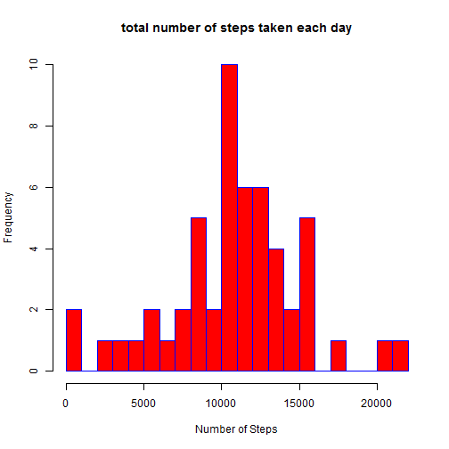

# Reproducible Research: Peer Assessment 1


```r
echo = TRUE  # visible code chunks
options(scipen = 1)  # Turn off scientific notations for numbers
```

## Loading and preprocessing the data


```r
unzip(zipfile = "activity.zip")
data <- read.csv("activity.csv")
```

## What is mean total number of steps taken per day?
1.Make a histogram of the total number of steps taken each day


```r
steps_by_date <- aggregate(steps ~ date, data, sum)
hist(steps_by_date$steps, main = paste("total number of steps taken each day"), col=I("red"),border="blue",   breaks=30, xlab="Number of Steps")
```

 

2.Calculate and report the **mean** and **median** total number of steps taken per day


```r
mean_steps <- mean(steps_by_date$steps)
```
mean is :10766


```r
median_steps <- median(steps_by_date$steps)
```
and median is : 10765

## What is the average daily activity pattern?
calculate average number of steps per day aggregated by interval:

```r
steps_by_interval <- aggregate(steps ~ interval, data, mean)
```

Use plot for making the time series of the 5-minute interval and average steps taken:

```r
plot(steps_by_interval$interval,steps_by_interval$steps, type="l", xlab="Interval", col = "firebrick", ylab="Number of Steps",main="Average Number of Steps per Day by Interval")
```

 

Which 5-minute interval, on average across all the days in the dataset, contains the maximum number of steps?


```r
max_interval <- steps_by_interval[which.max(steps_by_interval$steps),1]
```
The 5-minute interval, on average across all the days, containing the maximum number of steps is : 835

## Imputing missing values

```r
missing <- sum(is.na(data$steps))
```
1. How many missing values are : 2304

3. Fill in missing values using the **average interval value across all days**

```r
# Create a copy of the data.frame and iterate through each row replacing NAs
data2 = data
for (i in 1:length(data2$steps)) {
if(is.na(data2[i,"steps"])) {
data2[i, "steps"] = as.integer(
round(steps_by_interval[steps_by_interval$interval
== data2[i, "interval"], "steps"]))
}
}
# Check that there are no NAs in new data frame
sum(is.na(data2$steps))
```

```
## [1] 0
```
No missing values.
calculate average number of steps per day:

```r
steps_by_day_filledNAs <- aggregate(steps~date, data2, sum)
```
* Make a histogram of the total number of steps taken each day and Calculate and report the mean and median total number of steps taken per day. 

```r
hist(steps_by_day_filledNAs$steps, main = paste("Steps per Day, including missing values"), xlab="Number of Steps per day", col = "firebrick")
```

 

Calculate the  **mean** and **median** steps with the filled in values:


```r
mean_stepsNAs <- mean(steps_by_day_filledNAs$steps,na.rm = TRUE)
```
mean is :10766


```r
median_stepsNAs <- median(steps_by_day_filledNAs$steps)
```
and median is : 10762

The impact of filling missing data with the average number of steps in the same 5-min interval is that both the mean are equal  (rounded values to 10766 integer) and the median in case of filed values has 3 steps fewer.

## Are there differences in activity patterns between weekdays and weekends?
use of weekdays() and a factor variable to distinguish days of weekend from rest

```r
library(lattice)
data$date <- as.Date(data$date, "%Y-%m-%d")
day <- weekdays(data$date)
daylevel <- vector()
for (i in 1:nrow(data)) {
    if (day[i] == "Saturday") {
        daylevel[i] <- "weekend"
    } else if (day[i] == "Sunday") {
        daylevel[i] <- "weekend"
    } else {
        daylevel[i] <- "weekday"
    }
}
data$daylevel <- daylevel
data$daylevel <- factor(data$daylevel)

stepsByDay <- aggregate(steps ~ interval + daylevel, data, mean)
names(stepsByDay) <- c("interval", "daylevel", "steps")
```
Make a panel plot containing a time series plot (i.e. type = "l") of the 5-minute interval (x-axis) and the average number of steps taken, averaged across all weekday days or weekend days (y-axis).


```r
xyplot(steps ~ interval | daylevel, stepsByDay, type = "l", layout = c(1, 2), 
    xlab = "Interval", ylab = "Number of steps")
```

 

weekday activity peaks at 835 mins, and lowering after that. Weekend does not peak as high as weekday, however has higher period of activity from 800 mins to 2000 mins. During weekend activity is at higher level for more time, compared to more peaks of fewer activity period on non weekend days.
